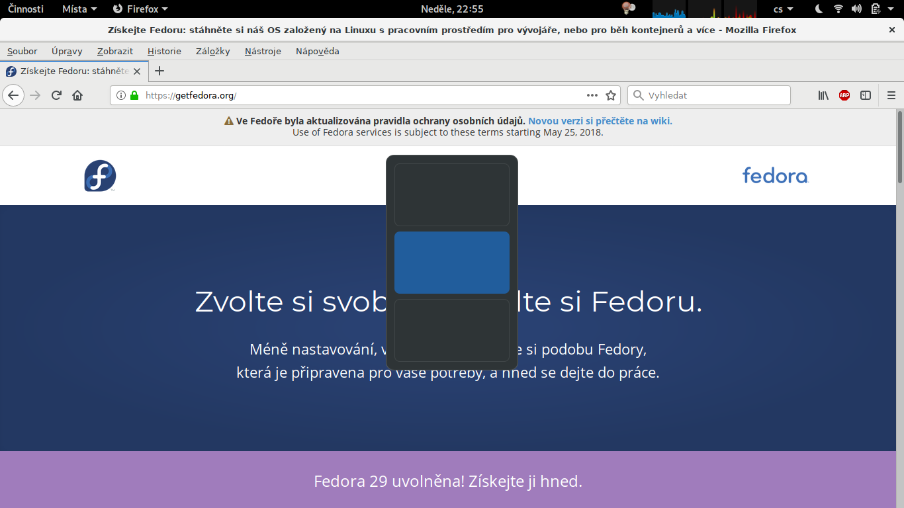
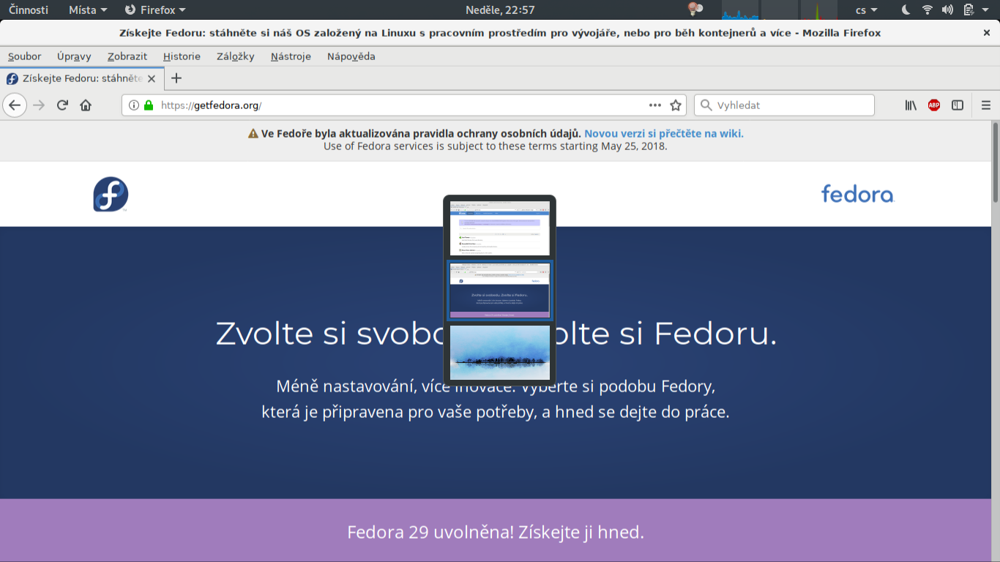

gnome-shell-extension-workspace-switcher-popup-thumbnails
=========================================================

GNOME Shell has a default popup displayed when switching between workspaces
using (default) shortcuts `CTRL+ALT+UP` or `CTRL+ALT+DOWN` that looks like this:

This extension makes the popup look similar to the workspace thumbnails box
that is displayed in the right panel in window overview mode
(displayed after pressing `SUPER` key) so it is easier to see the contents of
the workspaces:

